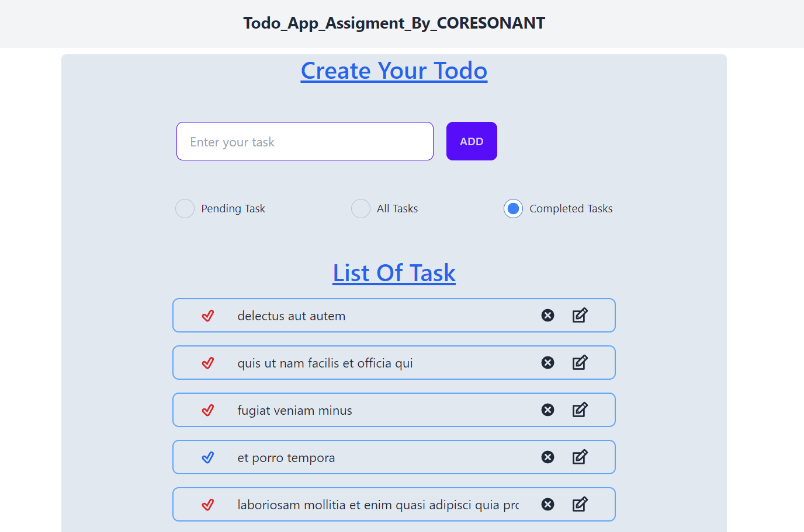

# TODO_APP_ASSIGMENT_CORESONANT

**React**, **Tailwind**, **React_Redux_toolkit**,
[DEMO](https://todo-rebu9nu4w-mrbhuyan06.vercel.app/)

##Problem Statement
Build a Todo application using React js that allows users to add, edit, and delete tasks. The
application should have the following functionalities:
● Display a list of existing tasks, showing the task name and its status (completed or not).
Initialize this list with the todos fetched from an API.
● Use the following API endpoint to retrieve the todos:
https://jsonplaceholder.typicode.com/users/1/todos.
● Each todo object from the API response will have the following properties:
● id (number): The unique identifier for the todo.
● title (string): The title of the todo.
● completed (boolean): Indicates whether the todo has been completed or not.
● Use this initial data to populate the list of tasks in your application.
● Provide an input field to add new tasks. When a task is added, it should appear in the list.
Perform the following validations before adding a task:
● The task name should not be empty.
● Allow users to mark a task as completed by clicking on it. Completed tasks should be
visually distinguishable (ex: By any different color).
● Allow users to edit the task name by clicking on an edit button/icon next to each task. When
a task is edited, update the task name in the list.
● Provide a delete button/icon to allow users to remove a task from the list.
● Implement a filter or tab functionality to toggle between displaying all tasks and completed
tasks.

## 👨‍💻 About Developer 👨‍💻

Hey I am Abhishek Bhuyan. Frontend Developer from Odisha . Very much eager to explore and develop scalable, user friendly, robust applications. I also take up couple of bootcamps on web development.

[LinkedIn](https://www.linkedin.com/in/abhisekh-bhuyan-5605b3230/)

Do reach out and provide your valuable insights about the project. I appreciate your inputs.

Do reach out if you have any project idea let's work together and achieve goals.

## 🪜 Steps to run the project in your machine 🪜

- Download the project locally
- Unzip the folder
- Open the unzipped folder in vscode

- open frontend folder
- Update package.json file in frontend folder.
- Open a new terminal to run frontend
- Run command 1: cd todo_app (If your terminal is not in this directory)
- Run command 2: npm install
- Run command 3: npm start

If your webpage doesn't load hit this url in your browser(DEMO): https://todo-rebu9nu4w-mrbhuyan06.vercel.app/

### 🎉 Here you go your application is up and running... 🎉

## ❤️ Glimpse of project ❤️

### Web View 🖥️

- Time taken: 5 hr

## 😄 Thanks for spending your valuable time on this project 😄
